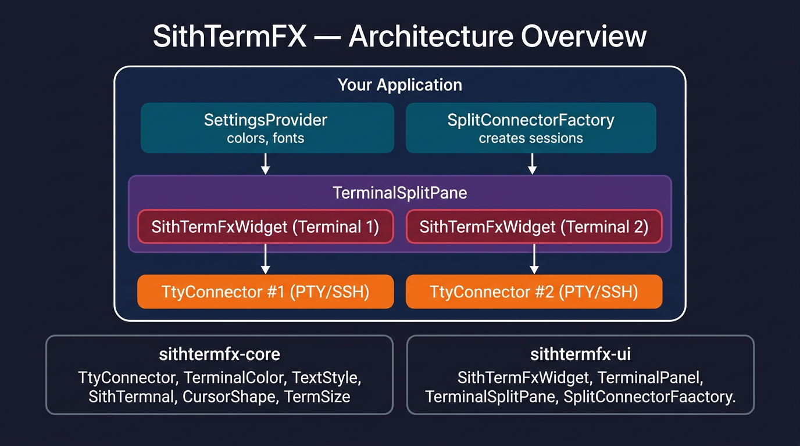
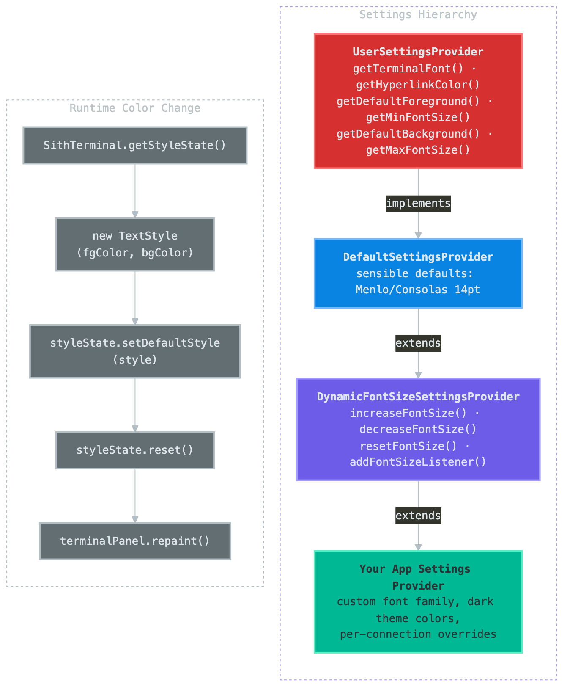
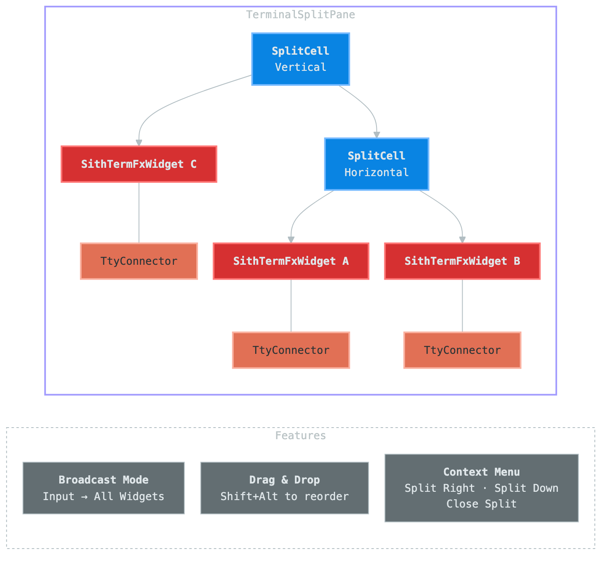
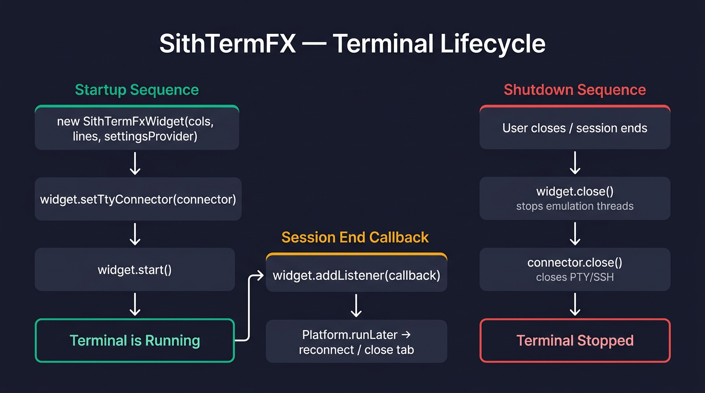
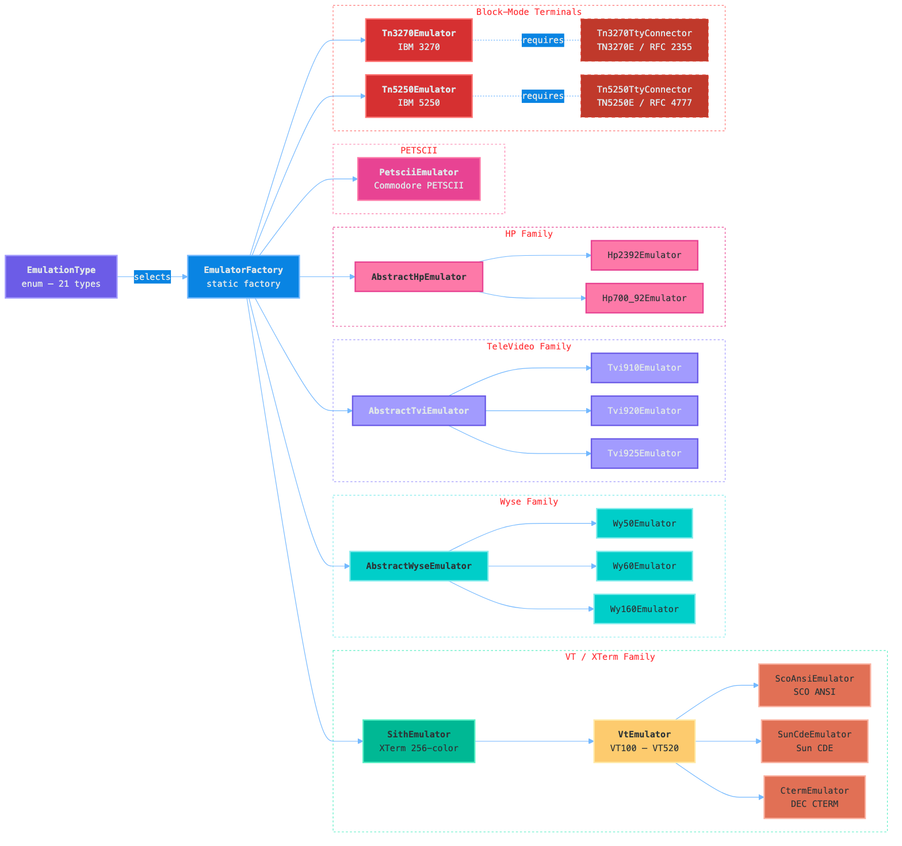

= SithTermFX Integration Guide
:toc: macro
:toc-title: Table of Contents
:toclevels: 3
:icons: font
:source-highlighter: rouge

This guide shows how to embed SithTermFX into your own JavaFX application.
Each section builds on the previous one, from a minimal "Hello Terminal" to
production-grade integration with split screens, theming, and SSH connectivity.

All examples reference the public API documented in link:public-api.adoc[public-api.adoc].
A working reference implementation can be found in the https://github.com/chardonnay/korTTY[korTTY] SSH client.

toc::[]

== Architecture Overview

The following diagram shows the high-level architecture and how the main components interact:

TIP: Diagram source: `docs/diagrams/architecture-overview.mmd`.
To regenerate: `./docs/generate-diagrams.sh architecture-overview`

'''

== 1. Dependencies

Release JARs are published on the https://github.com/chardonnay/SithTermFX/releases[GitHub Releases] page.
*No authentication is required* — download the `sithtermfx-core-*.jar` and `sithtermfx-ui-*.jar` files from the latest release.
They are attached to each release by CI and are not published to GitHub Packages.

=== Maven

[source,xml]
----
<dependency>
    <groupId>com.sithtermfx</groupId>
    <artifactId>sithtermfx-core</artifactId>
    <version>${sithtermfx.version}</version>
</dependency>
<dependency>
    <groupId>com.sithtermfx</groupId>
    <artifactId>sithtermfx-ui</artifactId>
    <version>${sithtermfx.version}</version>
</dependency>
----

To use the JARs from GitHub Releases without a Maven repository, download them and install to your local repo (once per version):

[source,bash]
----
mvn install:install-file -Dfile=sithtermfx-core-1.1.0.jar -DgroupId=com.sithtermfx -DartifactId=sithtermfx-core -Dversion=1.1.0 -Dpackaging=jar
mvn install:install-file -Dfile=sithtermfx-ui-1.1.0.jar -DgroupId=com.sithtermfx -DartifactId=sithtermfx-ui -Dversion=1.1.0 -Dpackaging=jar
----

=== Gradle (Kotlin DSL)

[source,kotlin]
----
implementation("com.sithtermfx:sithtermfx-core:${sithtermfxVersion}")
implementation("com.sithtermfx:sithtermfx-ui:${sithtermfxVersion}")
----

=== JPMS (module-info.java)

If your application uses the Java Module System, add:

[source,java]
----
module my.app {
    requires com.sithtermfx.core;
    requires com.sithtermfx.ui;
    // ...
}
----

=== Building from Source

Alternatively, build from source:

[source,bash]
----
git clone https://github.com/chardonnay/SithTermFX.git
cd SithTermFX
mvn clean install
----

The built artifacts are then available from `mavenLocal()` using version `1.1.0`.

'''

== 2. Quick Start — Minimal Terminal

The smallest possible SithTermFX integration: a terminal that displays
colored text from an in-memory data source.

[source,java]
----
package com.example;

import com.sithtermfx.core.TtyConnector;
import com.sithtermfx.core.util.TermSize;
import com.sithtermfx.ui.SithTermFxWidget;
import com.sithtermfx.ui.settings.DefaultSettingsProvider;
import javafx.application.Application;
import javafx.scene.Scene;
import javafx.stage.Stage;

import java.io.IOException;
import java.io.PipedReader;
import java.io.PipedWriter;

public class MinimalTerminalApp extends Application {

    private static final char ESC = 27;

    @Override
    public void start(Stage stage) throws Exception {
        // 1. Create the widget with default settings
        SithTermFxWidget widget = new SithTermFxWidget(80, 24,
                new DefaultSettingsProvider());

        // 2. Create a simple in-memory connector
        PipedWriter writer = new PipedWriter();
        widget.setTtyConnector(new InMemoryConnector(writer));
        widget.start();

        // 3. Write some colored text
        writer.write(ESC + "[32mHello, ");
        writer.write(ESC + "[1;34mSithTermFX!");
        writer.write(ESC + "[0m\r\n");

        // 4. Add the widget to the scene
        Scene scene = new Scene(widget.getPane(), 600, 400);
        stage.setTitle("Minimal Terminal");
        stage.setScene(scene);
        stage.setOnCloseRequest(e -> {
            widget.close();
            widget.getTtyConnector().close();
        });
        stage.show();
    }

    /**
     * Minimal TtyConnector backed by a PipedReader/PipedWriter pair.
     * Useful for testing or displaying static/scripted terminal output.
     */
    static class InMemoryConnector implements TtyConnector {
        private final PipedReader reader;
        private volatile boolean connected = true;

        InMemoryConnector(PipedWriter writer) throws IOException {
            this.reader = new PipedReader(writer);
        }

        @Override
        public int read(char[] buf, int offset, int length) throws IOException {
            return reader.read(buf, offset, length);
        }

        @Override
        public void write(byte[] bytes) { }

        @Override
        public void write(String string) { }

        @Override
        public boolean isConnected() { return connected; }

        @Override
        public void resize(TermSize termSize) { }

        @Override
        public int waitFor() { return 0; }

        @Override
        public boolean ready() throws IOException {
            return reader.ready();
        }

        @Override
        public String getName() { return "InMemory"; }

        @Override
        public void close() {
            connected = false;
            try { reader.close(); } catch (IOException ignored) { }
        }
    }

    public static void main(String[] args) {
        launch(args);
    }
}
----

*Key points:*

* `SithTermFxWidget` is the main entry point — it provides `getPane()` which
  returns a JavaFX `Region` you embed in your scene graph.
* `DefaultSettingsProvider` gives sensible defaults (Menlo/Consolas font, 14pt, light background).
* Call `widget.start()` after `setTtyConnector()` to begin terminal emulation.
* Always call `widget.close()` on shutdown.

'''

== 3. Connecting a Real Shell (PTY)

For a real interactive shell, use https://github.com/JetBrains/pty4j[Pty4J]
to create a pseudo-terminal:

[source,java]
----
import com.pty4j.PtyProcess;
import com.pty4j.PtyProcessBuilder;
import com.sithtermfx.app.pty.PtyProcessTtyConnector;
import com.sithtermfx.core.util.Platform;

private TtyConnector createLocalShell() {
    try {
        String[] command;
        Map<String, String> env = new HashMap<>(System.getenv());

        if (Platform.isWindows()) {
            command = new String[]{"cmd.exe"};
        } else {
            command = new String[]{"/bin/bash", "--login"};
            env.put("TERM", "xterm-256color");
        }

        PtyProcess process = new PtyProcessBuilder()
                .setCommand(command)
                .setEnvironment(env)
                .start();

        return new PtyProcessTtyConnector(process, StandardCharsets.UTF_8);
    } catch (Exception e) {
        throw new IllegalStateException("Failed to start PTY", e);
    }
}
----

Then wire it up:

[source,java]
----
SithTermFxWidget widget = new SithTermFxWidget(80, 24,
        new DefaultSettingsProvider());
widget.setTtyConnector(createLocalShell());
widget.addHyperlinkFilter(new DefaultHyperlinkFilter());
widget.start();

// Listen for session end (e.g. user typed "exit")
widget.addListener(terminalWidget -> {
    widget.close();
    widget.getTtyConnector().close();
});
----

'''

== 4. Custom TtyConnector (SSH Example)

For remote connections (SSH, Telnet, serial), implement the `TtyConnector`
interface. Below is a simplified SSH connector based on the
https://github.com/chardonnay/korTTY[korTTY] implementation using Apache MINA SSHD:

[source,java]
----
import com.sithtermfx.core.TtyConnector;
import com.sithtermfx.core.util.TermSize;
import org.apache.sshd.client.channel.ChannelShell;
import org.apache.sshd.client.session.ClientSession;

import java.io.*;
import java.nio.charset.StandardCharsets;

public class SshTtyConnector implements TtyConnector {

    private final ClientSession session;
    private final ChannelShell channel;
    private final InputStreamReader reader;
    private final OutputStream outputStream;
    private volatile boolean connected = true;

    public SshTtyConnector(ClientSession session, int columns, int rows)
            throws IOException {
        this.session = session;
        this.channel = session.createShellChannel();
        channel.setPtyType("xterm-256color");
        channel.setPtyColumns(columns);
        channel.setPtyLines(rows);
        channel.open().verify();
        this.reader = new InputStreamReader(
                channel.getInvertedOut(), StandardCharsets.UTF_8);
        this.outputStream = channel.getInvertedIn();
    }

    @Override
    public int read(char[] buf, int offset, int length) throws IOException {
        return reader.read(buf, offset, length);
    }

    @Override
    public void write(byte[] bytes) throws IOException {
        outputStream.write(bytes);
        outputStream.flush();
    }

    @Override
    public void write(String string) throws IOException {
        write(string.getBytes(StandardCharsets.UTF_8));
    }

    @Override
    public boolean isConnected() {
        return connected && session.isOpen() && channel.isOpen();
    }

    @Override
    public void resize(TermSize termSize) {
        try {
            channel.sendWindowChange(
                    termSize.getColumns(), termSize.getRows());
        } catch (IOException e) {
            // log warning
        }
    }

    @Override
    public int waitFor() throws InterruptedException {
        channel.waitFor(
                java.util.EnumSet.of(
                        org.apache.sshd.common.channel.Channel
                                .ClientChannelEvent.CLOSED),
                0L);
        Integer exitStatus = channel.getExitStatus();
        return exitStatus != null ? exitStatus : -1;
    }

    @Override
    public boolean ready() throws IOException {
        return reader.ready();
    }

    @Override
    public String getName() {
        return "SSH: " + session.getConnectAddress();
    }

    @Override
    public void close() {
        connected = false;
        try { channel.close(); } catch (IOException ignored) { }
        try { session.close(); } catch (IOException ignored) { }
    }
}
----

*Usage:*

[source,java]
----
ClientSession session = sshClient.connect("user", "host", 22)
        .verify().getSession();
session.addPasswordIdentity("password");
session.auth().verify();

SshTtyConnector connector = new SshTtyConnector(session, 80, 24);

SithTermFxWidget widget = new SithTermFxWidget(80, 24,
        new DefaultSettingsProvider());
widget.setTtyConnector(connector);
widget.start();
----

'''

== 5. Theming and Colors

The following diagram shows the settings/theming hierarchy and the runtime color change flow:

TIP: Diagram source: `docs/diagrams/settings-theming.mmd`.
To regenerate: `./docs/generate-diagrams.sh settings-theming`

=== Dark Theme

Override `getDefaultForeground()` and `getDefaultBackground()` in a custom settings provider:

[source,java]
----
import com.sithtermfx.core.TerminalColor;
import com.sithtermfx.ui.settings.DefaultSettingsProvider;

public class DarkThemeSettingsProvider extends DefaultSettingsProvider {

    @Override
    public TerminalColor getDefaultBackground() {
        return new TerminalColor(0, 0, 0);         // black
    }

    @Override
    public TerminalColor getDefaultForeground() {
        return new TerminalColor(255, 255, 255);    // white
    }
}
----

=== Changing Colors at Runtime

Access the terminal's `StyleState` to change foreground/background colors without reconnecting:

[source,java]
----
import com.sithtermfx.core.TerminalColor;
import com.sithtermfx.core.TextStyle;
import com.sithtermfx.core.model.SithTerminal;

public void applyColors(SithTermFxWidget widget,
                         int fgR, int fgG, int fgB,
                         int bgR, int bgG, int bgB) {
    var terminal = widget.getTerminal();
    if (terminal instanceof SithTerminal sithTerminal) {
        var styleState = sithTerminal.getStyleState();
        TextStyle newStyle = new TextStyle(
                TerminalColor.rgb(fgR, fgG, fgB),
                TerminalColor.rgb(bgR, bgG, bgB));
        styleState.setDefaultStyle(newStyle);
        styleState.reset();
        Platform.runLater(() -> widget.getTerminalPanel().repaint());
    }
}
----

=== Cursor Shape

Set the cursor shape to `BLINK_BLOCK`, `STEADY_BLOCK`, `BLINK_UNDERLINE`,
`STEADY_UNDERLINE`, `BLINK_VERTICAL_BAR`, or `STEADY_VERTICAL_BAR`:

[source,java]
----
import com.sithtermfx.core.CursorShape;

widget.getTerminalPanel().setCursorShape(CursorShape.STEADY_UNDERLINE);
----

'''

== 6. Dynamic Font Size

Use `DynamicFontSizeSettingsProvider` to enable runtime font resizing (Ctrl/Cmd + Plus/Minus/0):

[source,java]
----
import com.sithtermfx.ui.settings.DynamicFontSizeSettingsProvider;

// Start with 14pt font
DynamicFontSizeSettingsProvider settings =
        new DynamicFontSizeSettingsProvider(14f);

SithTermFxWidget widget = new SithTermFxWidget(80, 24, settings);
widget.setTtyConnector(createLocalShell());
widget.start();
----

=== Programmatic Font Control

[source,java]
----
// Zoom in by 2pt
settings.increaseFontSize(2);

// Zoom out by 2pt
settings.decreaseFontSize(2);

// Reset to default (14pt)
settings.resetFontSize();

// Set an exact size
settings.setFontSize(18f);

// React to font changes
settings.addFontSizeListener(() -> {
    System.out.println("Font size: " + settings.getFontSize());
});
----

=== Custom Font Size Range

Extend `DynamicFontSizeSettingsProvider` and override min/max:

[source,java]
----
public class AppSettingsProvider extends DynamicFontSizeSettingsProvider {

    public AppSettingsProvider(float initialSize) {
        super(initialSize);
    }

    @Override
    public float getMinFontSize() { return 8f; }

    @Override
    public float getMaxFontSize() { return 72f; }

    @Override
    public Font getTerminalFont() {
        return Font.font("JetBrains Mono", getTerminalFontSize());
    }
}
----

'''

== 7. Split Terminal

`TerminalSplitPane` manages nested horizontal/vertical splits with
independent sessions, context menus, broadcast mode, and drag-and-drop reordering.

The following diagram illustrates the internal split-cell tree and the resulting visual layout:

TIP: Diagram source: `docs/diagrams/split-terminal-structure.mmd`.
To regenerate: `./docs/generate-diagrams.sh split-terminal-structure`

=== Basic Setup

[source,java]
----
import com.sithtermfx.ui.split.TerminalSplitPane;
import com.sithtermfx.ui.split.SplitConnectorFactory;

DynamicFontSizeSettingsProvider settings =
        new DynamicFontSizeSettingsProvider(14f);

// Factory that creates a new connector for each split
SplitConnectorFactory connectorFactory = request -> createLocalShell();

TerminalSplitPane splitPane = new TerminalSplitPane(
        settings,
        connectorFactory,
        widget -> {
            // Configure each new widget (e.g. hyperlinks)
            widget.addHyperlinkFilter(new DefaultHyperlinkFilter());
        }
);

Scene scene = new Scene(splitPane, 800, 600);
splitPane.prefWidthProperty().bind(scene.widthProperty());
splitPane.prefHeightProperty().bind(scene.heightProperty());

stage.setScene(scene);
stage.setOnCloseRequest(e -> splitPane.closeAll());
stage.show();
----

=== Programmatic Split Control

[source,java]
----
import javafx.geometry.Orientation;
import com.sithtermfx.ui.split.SplitRequest;

// Split the focused pane horizontally (new shell)
splitPane.split(SplitRequest.SplitMode.NEW_CONNECTION,
                Orientation.HORIZONTAL);

// Split vertically (same server, new shell)
splitPane.split(SplitRequest.SplitMode.SAME_SERVER_NEW_SHELL,
                Orientation.VERTICAL);

// Get the currently focused widget
SithTermFxWidget focused = splitPane.getFocusedWidget();

// Iterate all widgets (e.g. to apply a theme)
for (SithTermFxWidget w : splitPane.getAllWidgets()) {
    applyColors(w, 255, 255, 255, 30, 30, 30);
}

// Toggle broadcast mode (input goes to all panes)
splitPane.toggleBroadcastMode();

// Close everything
splitPane.closeAll();
----

=== SSH Split with Connection Reuse

In a real SSH application, the `SplitConnectorFactory` inspects the
`SplitRequest` to decide whether to open a new channel on the same server
or prompt the user for a new connection:

[source,java]
----
SplitConnectorFactory connectorFactory = request -> {
    if (request == null) {
        return createNewSshConnection();
    }

    switch (request.getSplitMode()) {
        case SAME_SERVER_NEW_SHELL:
            // Reuse the SSH session from the parent widget
            SithTermFxWidget parent = request.getParentWidget();
            TtyConnector parentConnector = parent.getTtyConnector();
            if (parentConnector instanceof SshTtyConnector ssh) {
                return ssh.openNewChannel();
            }
            return createNewSshConnection();

        case NEW_CONNECTION:
            // Show a connection dialog and return the new connector
            return showConnectionDialogAndConnect();

        default:
            return null;
    }
};
----

=== Adding Side Panels (e.g. Timestamp Gutter)

`TerminalSplitPane` supports optional left-side panels per widget:

[source,java]
----
TerminalSplitPane splitPane = new TerminalSplitPane(
        settings,
        connectorFactory,
        widget -> { /* per-widget setup */ },
        widget -> {
            // Left panel factory — return a Region or null
            Label timestampLabel = new Label("00:00");
            timestampLabel.setStyle("-fx-font-size: 10; -fx-padding: 2;");
            return timestampLabel;
        }
);

// Or set/remove per widget later:
splitPane.setWidgetLeftPanel(widget, new Label("panel"));
splitPane.removeWidgetLeftPanel(widget);
----

=== Extra Context Menu Items

Add application-specific entries to the built-in right-click menu:

[source,java]
----
splitPane.setExtraMenuItemsFactory(widget -> {
    MenuItem reconnect = new MenuItem("Reconnect");
    reconnect.setOnAction(e -> reconnectWidget(widget));

    CheckMenuItem timestamps = new CheckMenuItem("Show Timestamps");
    timestamps.setOnAction(e -> toggleTimestamps(widget));

    return List.of(reconnect, timestamps);
});
----

'''

== 8. Hyperlinks

SithTermFX can detect and highlight clickable links in terminal output.
`DefaultHyperlinkFilter` detects URLs automatically:

[source,java]
----
import com.sithtermfx.ui.DefaultHyperlinkFilter;

widget.addHyperlinkFilter(new DefaultHyperlinkFilter());
----

Hyperlink appearance is controlled by `UserSettingsProvider`:

[cols="1,2",options="header"]
|===
| Method                           | Purpose
| `getHyperlinkColor()`            | Custom color for detected links
| `getHyperlinkHighlightingMode()` | `ALWAYS`, `HOVER`, or `NEVER`
|===

Override in your settings provider:

[source,java]
----
@Override
public TerminalColor getHyperlinkColor() {
    return new TerminalColor(100, 150, 255);  // light blue
}

@Override
public HyperlinkStyle.HighlightMode getHyperlinkHighlightingMode() {
    return HyperlinkStyle.HighlightMode.HOVER;
}
----

'''

== 9. Terminal Lifecycle

The following diagram shows the complete startup, running, and shutdown flow:

TIP: Diagram source: `docs/diagrams/lifecycle-diagram.mmd`.
To regenerate: `./docs/generate-diagrams.sh lifecycle-diagram`

=== Startup Sequence

[source,text]
----
SithTermFxWidget(columns, lines, settingsProvider)
        │
        ▼
   setTtyConnector(connector)
        │
        ▼
     start()              ← begins reading from connector
        │
        ▼
   [Terminal is running]
----

=== Shutdown

Always close both the widget and the connector:

[source,java]
----
stage.setOnCloseRequest(event -> {
    widget.close();                     // stops emulation threads
    widget.getTtyConnector().close();   // closes underlying process/connection
});
----

For split terminals:

[source,java]
----
stage.setOnCloseRequest(event -> {
    splitPane.closeAll();   // closes all widgets and their connectors
});
----

=== Session End Listener

React when the remote side closes the connection (e.g. user typed `exit`):

[source,java]
----
widget.addListener(terminalWidget -> {
    Platform.runLater(() -> {
        // e.g. close the tab, reconnect, show a message
        widget.close();
    });
});
----

'''

== 10. Advanced Integration Patterns

These patterns are extracted from the
https://github.com/chardonnay/korTTY[korTTY] SSH client, which is a
production application built on SithTermFX.

=== Pattern: Custom Settings Provider with Per-Connection Override

[source,java]
----
public class AppSettingsProvider extends DynamicFontSizeSettingsProvider {

    private String fontFamily = "Menlo";

    public AppSettingsProvider(float initialSize) {
        super(initialSize);
    }

    public void setFontFamily(String family) {
        this.fontFamily = family;
    }

    @Override
    public Font getTerminalFont() {
        return Font.font(fontFamily, getTerminalFontSize());
    }

    @Override
    public TerminalColor getDefaultBackground() {
        return new TerminalColor(30, 30, 30);
    }

    @Override
    public TerminalColor getDefaultForeground() {
        return new TerminalColor(204, 204, 204);
    }
}
----

=== Pattern: Global Exception Handler for Known Bugs

SithTermFX may occasionally throw a harmless `ClassCastException` from its
internal animation timer. Suppress it globally:

[source,java]
----
Thread.setDefaultUncaughtExceptionHandler((thread, throwable) -> {
    if (throwable instanceof ClassCastException) {
        String msg = throwable.getMessage();
        if (msg == null ||
            (msg.contains("KeyFrame") && msg.contains("Timeline"))) {
            return;  // known harmless bug — ignore
        }
    }
    logger.error("Uncaught exception in {}", thread.getName(), throwable);
});
----

=== Pattern: Font Zoom via Scene Accelerators

Wire Ctrl/Cmd+Plus, Ctrl/Cmd+Minus, Ctrl/Cmd+0 to the settings provider:

[source,java]
----
scene.getAccelerators().put(
    new KeyCodeCombination(KeyCode.EQUALS, KeyCombination.SHORTCUT_DOWN),
    () -> settings.increaseFontSize(2));

scene.getAccelerators().put(
    new KeyCodeCombination(KeyCode.MINUS, KeyCombination.SHORTCUT_DOWN),
    () -> settings.decreaseFontSize(2));

scene.getAccelerators().put(
    new KeyCodeCombination(KeyCode.DIGIT0, KeyCombination.SHORTCUT_DOWN),
    () -> settings.resetFontSize());
----

=== Pattern: Apply Theme to All Split Panes

[source,java]
----
public void applyTheme(TerminalSplitPane splitPane,
                        int fgR, int fgG, int fgB,
                        int bgR, int bgG, int bgB,
                        CursorShape cursorShape) {
    for (SithTermFxWidget widget : splitPane.getAllWidgets()) {
        // Colors
        var terminal = widget.getTerminal();
        if (terminal instanceof SithTerminal st) {
            var style = st.getStyleState();
            style.setDefaultStyle(new TextStyle(
                    TerminalColor.rgb(fgR, fgG, fgB),
                    TerminalColor.rgb(bgR, bgG, bgB)));
            style.reset();
        }
        // Cursor
        widget.getTerminalPanel().setCursorShape(cursorShape);
        // Repaint
        Platform.runLater(() -> widget.getTerminalPanel().repaint());
    }
}
----

=== Pattern: Disconnect Callback on TtyConnector

Add a disconnect listener to your connector so the UI can react:

[source,java]
----
public interface DisconnectListener {
    void onDisconnected(String reason);
}

public class SshTtyConnector implements TtyConnector {
    private DisconnectListener disconnectListener;

    public void setDisconnectListener(DisconnectListener listener) {
        this.disconnectListener = listener;
    }

    @Override
    public void close() {
        connected = false;
        // ... close channel/session ...
        if (disconnectListener != null) {
            disconnectListener.onDisconnected("Connection closed");
        }
    }
}
----

'''

== 11. Terminal Emulations

SithTermFX ships with 21 terminal emulation types managed through the `EmulationType` enum.
Each type carries metadata about its TERM name, default dimensions, screen mode (stream vs. block),
and color support. The `EmulatorFactory` instantiates the correct emulator automatically.

=== Selecting an Emulation Type

Call `setEmulationType()` on the widget *before* `start()`:

[source,java]
----
import com.sithtermfx.core.emulator.EmulationType;

SithTermFxWidget widget = new SithTermFxWidget(
        EmulationType.VT220.getDefaultColumns(),
        EmulationType.VT220.getDefaultRows(),
        new DefaultSettingsProvider());
widget.setEmulationType(EmulationType.VT220);
widget.setTtyConnector(createLocalShell());
widget.start();
----

When connecting via PTY, set the `TERM` environment variable to match the emulation:

[source,java]
----
Map<String, String> env = new HashMap<>(System.getenv());
EmulationType emu = EmulationType.VT320;
env.put("TERM", emu.getTermName());   // "vt320"

PtyProcess process = new PtyProcessBuilder()
        .setCommand(command)
        .setEnvironment(env)
        .setInitialColumns(emu.getDefaultColumns())
        .setInitialRows(emu.getDefaultRows())
        .start();
----

=== Stream-Mode Emulations (VT, Wyse, TVI, HP, etc.)

Stream-mode terminals process character-by-character data using escape sequences.
All stream-mode emulations work with any standard `TtyConnector` (PTY, SSH, serial).

[source,java]
----
// DEC VT family (VT100, VT102, VT220, VT320, VT420, VT520)
widget.setEmulationType(EmulationType.VT100);

// Wyse terminals
widget.setEmulationType(EmulationType.WY50);
widget.setEmulationType(EmulationType.WY60);
widget.setEmulationType(EmulationType.WY160);

// TeleVideo terminals
widget.setEmulationType(EmulationType.TVI910);
widget.setEmulationType(EmulationType.TVI920);
widget.setEmulationType(EmulationType.TVI925);

// HP terminals
widget.setEmulationType(EmulationType.HP2392);
widget.setEmulationType(EmulationType.HP700_92);

// ANSI derivatives
widget.setEmulationType(EmulationType.SCOANSI);
widget.setEmulationType(EmulationType.SUN_CDE);
widget.setEmulationType(EmulationType.CTERM);

// Commodore PETSCII (40 columns, 16 colors)
widget.setEmulationType(EmulationType.PETSCII);
----

=== Block-Mode Emulations (TN3270 / TN5250)

Block-mode terminals use a field-oriented, forms-based paradigm with dedicated
Telnet protocol extensions and EBCDIC encoding. They require their own
`TtyConnector` implementations.

==== TN3270 — IBM Mainframe (RFC 2355)

Use `Tn3270TtyConnector` for TN3270E connections to an IBM mainframe or z/OS host:

[source,java]
----
import com.sithtermfx.core.emulator.EmulationType;
import com.sithtermfx.core.emulator.tn3270.Tn3270TtyConnector;

// 1. Create the TN3270 connector
Tn3270TtyConnector connector = new Tn3270TtyConnector(
        "mainframe.example.com",   // host
        23,                         // port (standard TN3270 port)
        "IBM-3279-2-E"             // terminal type
);

// Optional: set a specific LU name
connector.setLuName("LU00A1");

// 2. Connect (performs TN3270E negotiation)
connector.connect();

// 3. Wire up the widget
SithTermFxWidget widget = new SithTermFxWidget(80, 24,
        new DefaultSettingsProvider());
widget.setEmulationType(EmulationType.TN3270);
widget.setTtyConnector(connector);
widget.start();
----

The `Tn3270TtyConnector` handles:

* Full TN3270E (RFC 2355) option negotiation (BINARY, EOR, TN3270E)
* Device-type and LU-name negotiation
* EBCDIC ↔ Unicode conversion via `EbcdicCodec`
* 3270 data stream framing with IAC EOR delimiters
* Fallback to plain TN3270 (RFC 1576) if TN3270E is rejected

The `Tn3270Emulator` processes:

* 3270 commands: Write, Erase/Write, Erase/Write Alternate, Read Buffer, Read Modified
* Field attributes: protected, numeric, MDT, display intensity
* AID keys: Enter, PF1–PF24, PA1–PA3, Clear
* Screen buffer management with 24×80 addressable positions

==== TN5250 — IBM AS/400 / iSeries (RFC 4777)

Use `Tn5250TtyConnector` for TN5250E connections to an IBM iSeries (AS/400) host:

[source,java]
----
import com.sithtermfx.core.emulator.EmulationType;
import com.sithtermfx.core.emulator.tn5250.Tn5250TtyConnector;

// 1. Create the TN5250 connector
Tn5250TtyConnector connector = new Tn5250TtyConnector(
        "as400.example.com",       // host
        23                          // port (standard TN5250 port)
);

// Optional: configure device name and code page
connector.setDeviceName("DSP01");
connector.setCodePage("037");

// 2. Connect (performs TN5250E negotiation)
connector.connect();

// 3. Wire up the widget
SithTermFxWidget widget = new SithTermFxWidget(80, 24,
        new DefaultSettingsProvider());
widget.setEmulationType(EmulationType.TN5250);
widget.setTtyConnector(connector);
widget.start();
----

The `Tn5250TtyConnector` handles:

* TN5250E (RFC 4777) option negotiation (BINARY, EOR, TERMINAL-TYPE, NEW-ENVIRON)
* NEW-ENVIRON exchange for IBM-specific variables (IBMRSEED, KBDTYPE, CODEPAGE, DEVNAME)
* 5250 record framing with GDS headers and IAC EOR delimiters
* EBCDIC ↔ Unicode conversion

The `Tn5250Emulator` processes:

* 5250 commands: Write to Display, Clear Unit, Clear Format Table, Read Input Fields, Read Screen
* Field attributes: bypass, MDT, entry type (alpha, numeric, signed-numeric)
* AID keys: Enter, F1–F24, Help, Print, Record Backspace, Page Up/Down
* 5250-specific screen buffer with input field tracking

=== Querying Emulation Metadata

Use the `EmulationType` enum to inspect emulation properties:

[source,java]
----
EmulationType emu = EmulationType.TN3270;

String termName = emu.getTermName();             // "IBM-3279-2-E"
String displayName = emu.getDisplayName();       // "IBM TN3270"
int columns = emu.getDefaultColumns();           // 80
int rows = emu.getDefaultRows();                 // 24
boolean isBlock = emu.isBlockMode();             // true
boolean isVt = emu.isVtFamily();                 // false

EmulationType.ScreenMode mode = emu.getScreenMode();       // BLOCK
EmulationType.ColorSupport color = emu.getColorSupport();  // COLOR_16
----

=== Building an Emulation Selector

Iterate all emulation types to populate a UI combo box or menu:

[source,java]
----
import javafx.scene.control.ComboBox;
import javafx.util.StringConverter;

ComboBox<EmulationType> emulationBox = new ComboBox<>();
emulationBox.getItems().addAll(EmulationType.values());
emulationBox.setValue(EmulationType.XTERM);

emulationBox.setConverter(new StringConverter<>() {
    @Override
    public String toString(EmulationType type) {
        return type == null ? "" : type.getDisplayName();
    }

    @Override
    public EmulationType fromString(String string) {
        for (EmulationType t : EmulationType.values()) {
            if (t.getDisplayName().equals(string)) return t;
        }
        return EmulationType.XTERM;
    }
});

emulationBox.setOnAction(e -> {
    EmulationType selected = emulationBox.getValue();
    widget.setEmulationType(selected);
});
----

=== Emulation Architecture Overview

The following diagram shows the emulation class hierarchy and how `EmulatorFactory`
selects the correct emulator based on `EmulationType`:

TIP: Diagram source: `docs/diagrams/emulation-architecture.mmd`.
To regenerate: `./docs/generate-diagrams.sh emulation-architecture`

'''

== Running the Built-in Examples

SithTermFX ships with ready-to-run examples:

[source,bash]
----
# Basic shell example
mvn javafx:run -pl sithtermfx-app

# Dark theme
mvn javafx:run -pl sithtermfx-app   # uncomment theme=dark in pom.xml

# Split terminal example
mvn javafx:run -pl sithtermfx-app -Psplit
----

Source code:

* link:../sithtermfx-app/src/main/java/com/sithtermfx/app/example/BasicTerminalShellExample.java[BasicTerminalShellExample.java]
* link:../sithtermfx-app/src/main/java/com/sithtermfx/app/example/SplitTerminalShellExample.java[SplitTerminalShellExample.java]
* link:../sithtermfx-app/src/main/java/com/sithtermfx/app/example/BasicTerminalExample.java[BasicTerminalExample.java]
